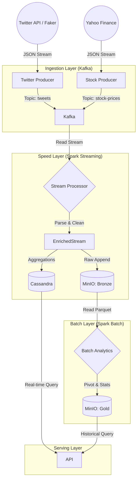

# 🔄 Data Flow Architecture Documentation

**System:** Real-time Stock Sentiment Analysis Pipeline  
**Architecture Pattern:** Lambda Architecture (Hybrid Streaming & Batch)  
**Last Updated:** December 18, 2025

---

## 🏗️ 1. High-Level Architecture

The system implements a **Lambda Architecture** designed to handle massive volumes of data with both low-latency processing (Speed Layer) and high-accuracy historical analysis (Batch Layer).

### 📐 Mermaid Diagram



---

## 🚀 2. Data Flow Steps in Detail

### Step 1: Data Ingestion (Producers)
Data enters the system through two independent producers running in Kubernetes.

*   **Twitter Producer:**
    *   **Source:** Simulates Twitter firehose (or connects to API).
    *   **Payload:** JSON containing `created_at`, `text`, `user_id`.
    *   **Target:** Kafka Topic `tweets`.
    *   **Throughput:** Configurable, typicall 10-50 events/sec for demo.

*   **Stock Producer:**
    *   **Source:** Real-time market data ticks.
    *   **Payload:** JSON containing `symbol`, `trade_timestamp`, `price`, `volume`.
    *   **Target:** Kafka Topic `stock-prices`.

### Step 2: Message Buffering (Kafka)
Apache Kafka acts as the central nervous system, decoupling producers from consumers and handling backpressure.

*   **Topic `tweets`:** 1 Partition, Replication Factor 1. Retention: 7 days.
*   **Topic `stock-prices`:** 1 Partition, Replication Factor 1. Retention: 7 days.
*   **Serialization:** String/JSON.

### Step 3: Speed Layer (Spark Structured Streaming)
This is the core real-time processing engine.

*   **Input:** Reads from Kafka topics starting from `earliest` (or latest).
*   **Transformations:**
    1.  **Parsing:** `from_json` using defined Schema.
    2.  **Event Time Extraction:** Converts string timestamps to Spark Timestamp types.
    3.  **Entity Extraction:** Regex extracts `$SYMBOL` (e.g., $AAPL) from tweet text.
    4.  **Sentiment Analysis:** UDF applies NLTK VADER to calculate `compound` score (-1.0 to 1.0).
    5.  **Watermarking:** Handles late data (up to 2 minutes late) to ensure window collection accuracy.
*   **Outputs (Sinks):**
    *   **Sink 1 (Data Lake):** Append-only write to MinIO Bronze (Parquet) for historical archive.
    *   **Sink 2 (Operational DB):** Upsert to Cassandra tables (`tweets`, `market_data`) for instant API access.
    *   *(Concept)* **Sink 3 (Silver):** Stream-Stream Join correlating Tweets with Prices (within ±1 day window).
    *   *(Concept)* **Sink 4 (Gold):** Sliding Window aggregations (5-min windows).

### Step 4: Batch Layer (Spark Batch)
Periodic jobs that process historical data for accuracy and complex analytics.

*   **Input:** Reads full history from MinIO Bronze (`tweets_v2/`).
*   **Transformations:**
    1.  **Pivot:** Reshapes data to show Sentiment vs Topic per Hour.
    2.  **Statistics:** Calculates Standard Deviation, Percentiles (0.5, 0.95), and Volatility.
    3.  **Trends:** calculates Moving Averages (MA) using Window functions.
*   **Output:** Overwrites analytics reports in MinIO Gold (`batch_topic_statistics`, `batch_trend_analysis`).

### Step 5: Serving Layer
Where data "lives" for end-user consumption.

*   **MinIO (Data Lake):**
    *   **Bronze:** Raw history.
    *   **Silver:** Enriched/Joined data.
    *   **Gold:** High-value aggregated reports (Parquet).
*   **Cassandra (NoSQL):**
    *   Optimized for point lookups (e.g., "Give me latest tweets for $TSLA").
    *   Time-series optimized (Clustering Key: `timestamp DESC`).

---

## � 3. Data Schemas

### A. Kafka JSON Payloads

**Topic: `tweets`**
```json
{
  "created_at": "2025-12-18 14:30:00",
  "text": "Huge breakout for $TSLA today! #bullish",
  "user_id": "user_123"
}
```

**Topic: `stock-prices`**
```json
{
  "symbol": "TSLA",
  "trade_timestamp": "2025-12-18 14:30:05",
  "open_price": 250.5,
  "close_price": 251.2,
  "volume": 1500
}
```

### B. Cassandra Tables

**Keyspace:** `twitter`

**Table: `tweets`**
| Column | Type | Description |
| :--- | :--- | :--- |
| `topic` | TEXT | Partition Key (Symbol) |
| `ingest_timestamp` | TIMESTAMP | Clustering Key (DESC) |
| `id` | UUID | Unique ID |
| `text` | TEXT | Original Content |
| `sentiment_score` | FLOAT | Calculated Polarity |

**Table: `market_data`**
| Column | Type | Description |
| :--- | :--- | :--- |
| `symbol` | TEXT | Partition Key |
| `trade_timestamp` | TIMESTAMP | Clustering Key (DESC) |
| `close_price` | DOUBLE | Market value |
| `volume` | BIGINT | Trade volume |

### C. MinIO Parquet Structure

**Bronze Layer:** `s3a://twitter-bronze/tweets_v2/`
```text
/topic=AAPL/
  part-00000-xyz.snappy.parquet
  part-00001-abc.snappy.parquet
/topic=TSLA/
  ...
```

**Gold Layer:** `s3a://twitter-gold/batch_trend_analysis/`
```text
/topic=AAPL/
  part-00000...parquet
```
*Columns:* `topic`, `ingest_timestamp`, `sentiment_score`, `moving_avg_10`

---

## 🛡️ 4. Data Quality & Resilience

### Late Data Handling (Watermarking)
*   **Challenge:** Data from Kafka may arrive out-of-order due to network latency.
*   **Solution:** Spark Watermarking set to **2 minutes**.
    *   Events arriving >2 mins late are dropped from **Aggregation state** to prevent memory explosion.
    *   Note: Late data is *still written* to Bronze Layer (Append mode) but ignored for real-time window calculations.

### Fault Tolerance
*   **Checkpointing:** Spark creates checkpoints in S3 (`s3a://spark-checkpoints/`) every 60s.
*   **WAL (Write Ahead Log):** Kafka ensures data durability before consumption.
*   **Idempotency:** Cassandra writes are idempotent (Same ID updates same row).

### Event Time vs Processing Time
*   **Decision:** We strictly use **Event Time** (`created_at`, `trade_timestamp`) for all business logic (Windows, Joins, Aggregations).
*   **Processing Time:** Only used for latency monitoring (`ingest_timestamp`).

---

## � 5. Use Cases Validated

1.  **Real-time Dashboard:** Frontend queries Cassandra for the last 5 minutes of tweets/prices.
2.  **Historical Trend Analysis:** Data Scientists query MinIO Gold (Parquet) for monthly sentiment trends.
3.  **Alerting:** (Future) Trigger alerts when `sentiment_score` < -0.5 and Price drops > 2%.
